# Mermaid 渲染 e2e 覆盖测试

> 自动生成的测试 fixture。覆盖 mermaid 全部主要图表类型 + 中文 / emoji / 边界场景。
> 跑 `tests/e2e/run.sh` 时会被复制进 vault 并触发同步。
> 不要手动编辑(脚本会重新生成)。

## 1. flowchart

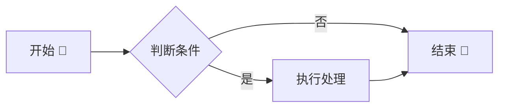

## 2. sequenceDiagram

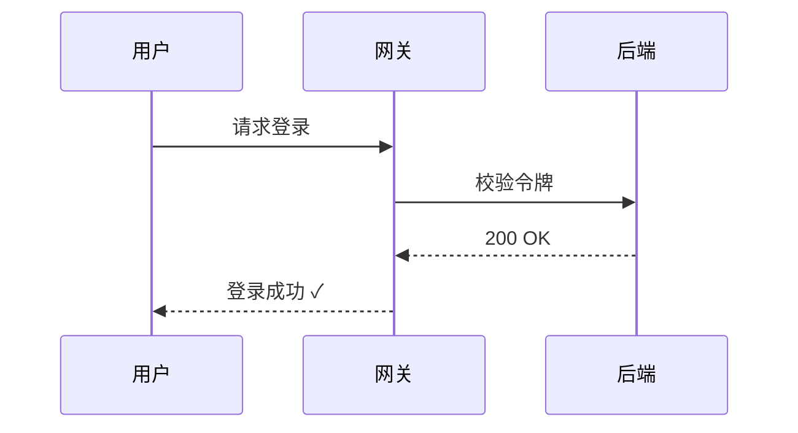

## 3. classDiagram

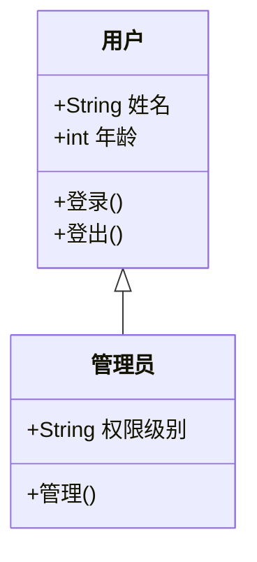

## 4. stateDiagram-v2

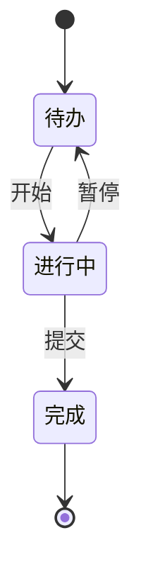

## 5. erDiagram

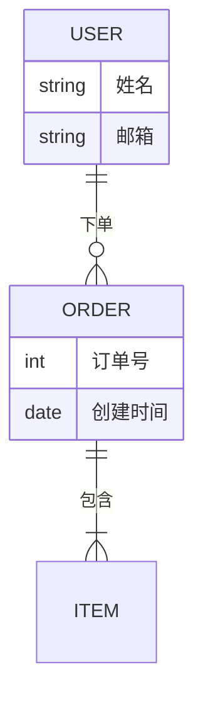

## 6. gantt (本次回归核心 — 时间轴宽度问题)

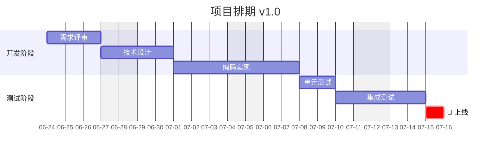

## 7. timeline

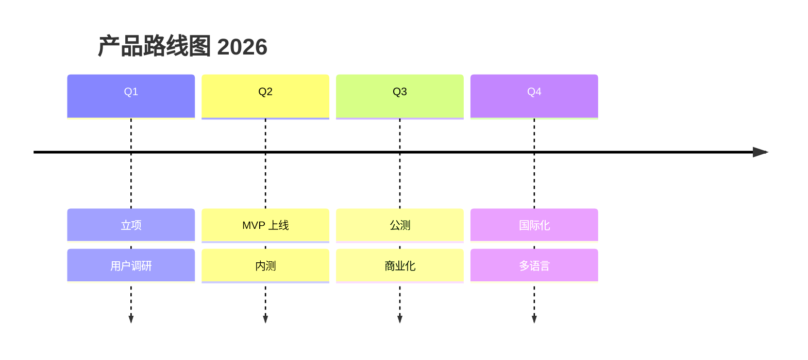

## 8. pie

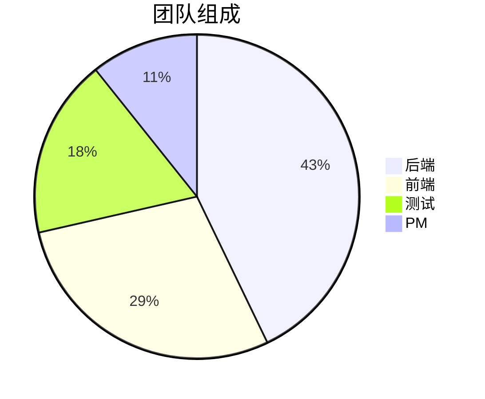

## 9. journey

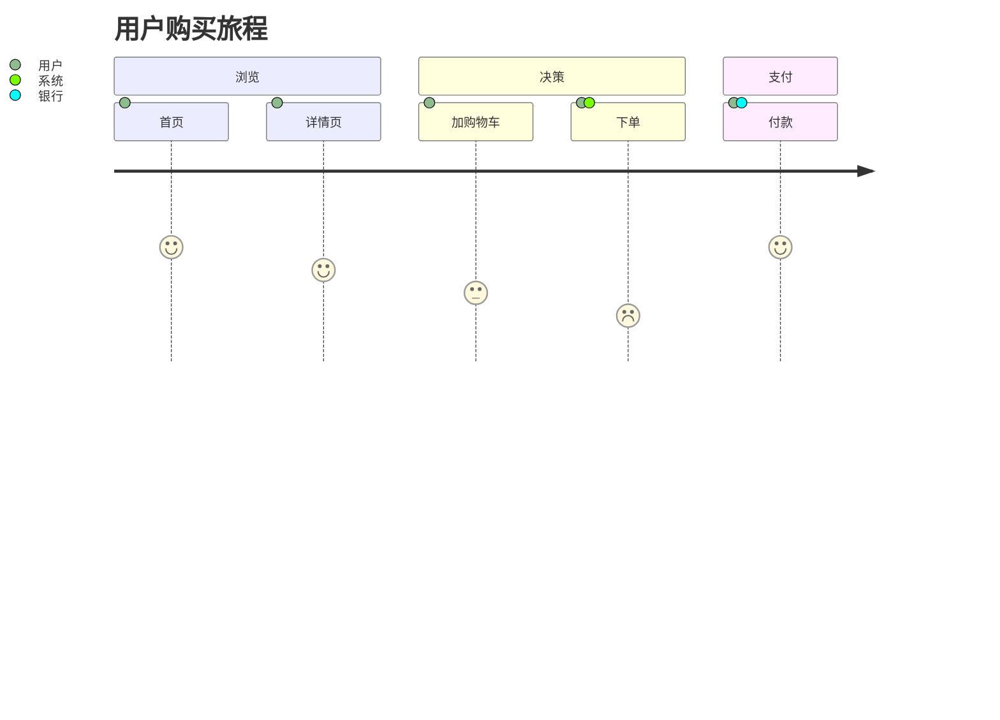

## 10. gitGraph

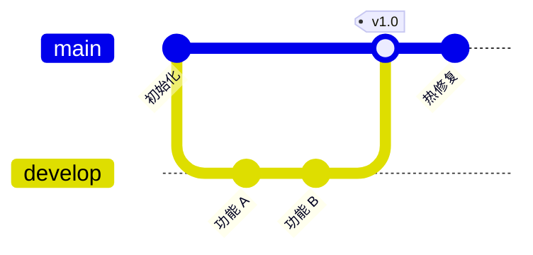

## 11. mindmap

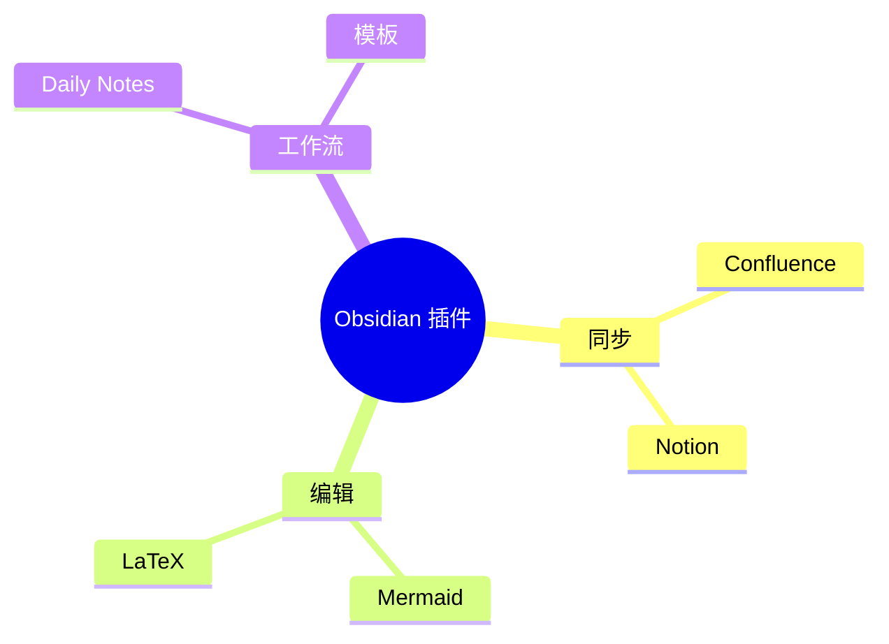

## 12. quadrantChart

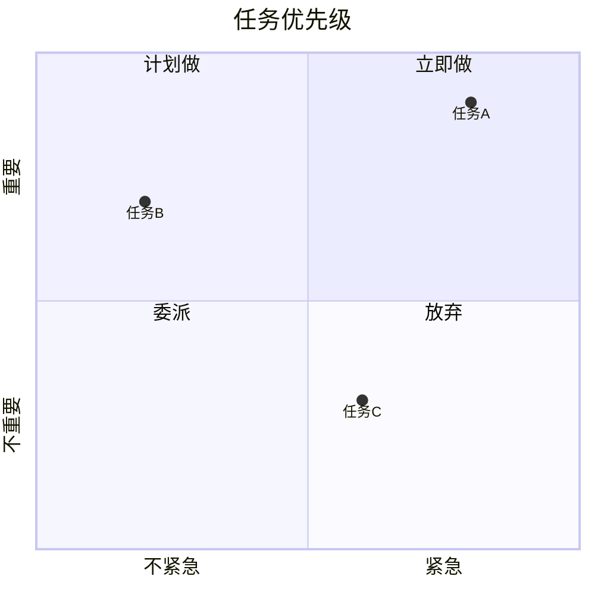

## 13. requirementDiagram

```mermaid
requirementDiagram
    requirement 登录功能 {
        id: 1
        text: 用户必须能用邮箱登录
        risk: high
        verifymethod: test
    }
    element 登录模块 {
        type: 模块
    }
    登录模块 - satisfies -> 登录功能
```

## 14. xychart-beta

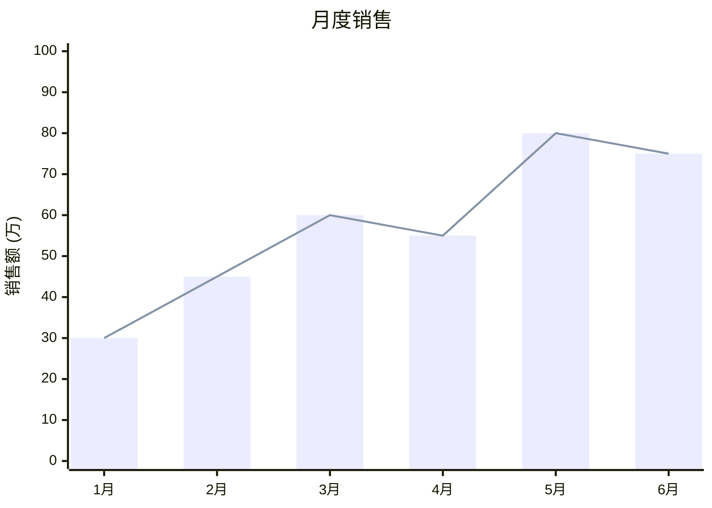

## 15. sankey-beta

```mermaid
sankey-beta

源,目标,值
访客,首页,1000
首页,详情页,400
首页,搜索,300
详情页,下单,150
搜索,详情页,200
```

## 16. C4Context

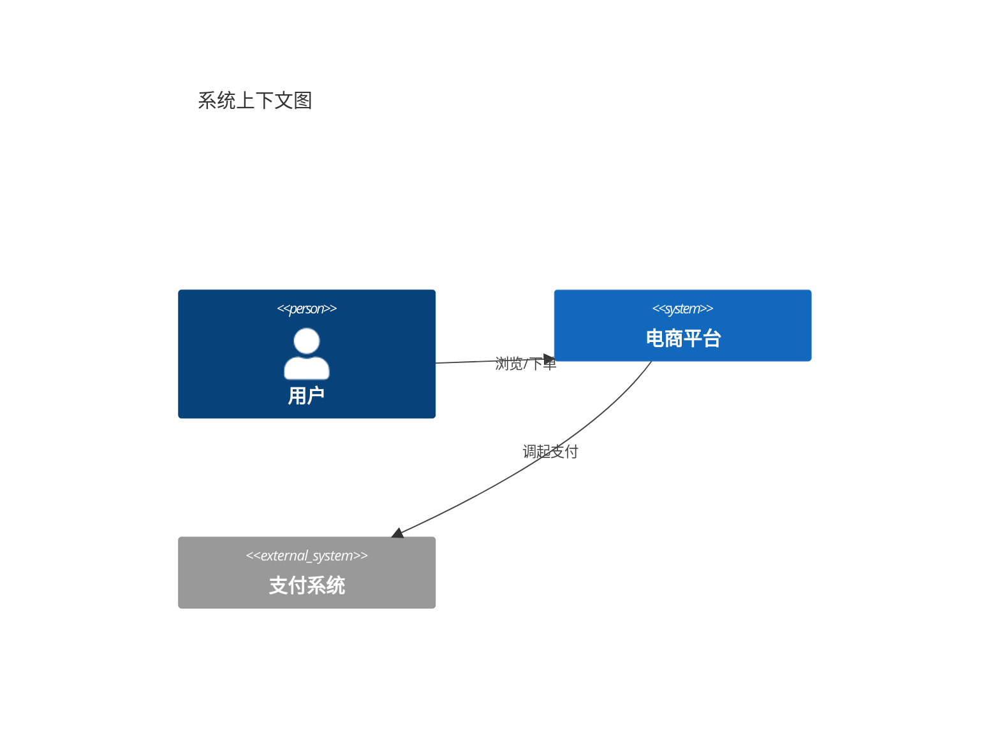

## 17. 边界 — 同一种图复用(去重测试)

> 跟 §1 完全一样的 flowchart,验证 hash 去重逻辑。


## 18. 边界 — 含 LaTeX-like 标签

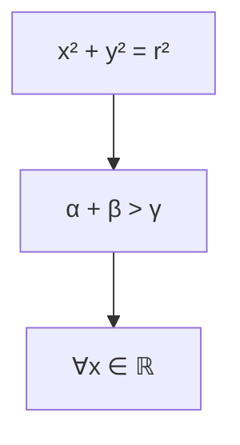

## 19. 故意写坏 — 验证 fallback 退回代码块

> 渲染器应该捕获异常 + 在 storage 里保留为代码块,而不是抛出导致整页同步失败。

```mermaid
this is not valid mermaid syntax
xxx --> yyy ((( broken
```

## 20. 回归测试 — issue #1 / bibendi 报告 Bug A:文件名含空格的图片附件

> Obsidian 的 "Pasted image YYYYMMDDHHMMSS.png" 文件名带空格,wikilink 形式 → 标准 markdown 链接时
> URL 没编码,markdown-it 解析失败,原文输出。**期望 Confluence 上看到 `<ac:image>` 而非原始 markdown 文本。**
>
> 引用的图片由 e2e 脚本运行时投放到 vault(`test image with spaces.png`,1×1 透明 PNG)。

![[test image with spaces.png|alt-with-space]]

## 21. 回归测试 — issue #1 / bibendi 报告 Bug B:PlantUML 附件未替换为 ac:image

> PlantUML 渲染附件已生成、上传成功,但 fence 代码块没替换为 `<ac:image>`,仍以代码块形式显示。
> Mermaid 同链路正常,所以是 plantuml 专属问题。**期望 Confluence 上看到 `<ac:image ri:filename="plantuml-*.png">`。**
>
> 需要 e2e 脚本提前把 `renderPlantUmlToPng` 开关打开。

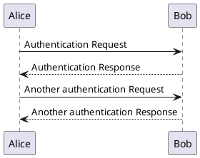

## 22. 回归测试 — 空格缩进 fence(list-indent)

> Bug 现象:`extractFenceBlocks` 按整行 slice 拿 content(含 4 格缩进),markdown-it 按 CommonMark
> 剥缩进 → 两侧 hash 不一致 → fence renderer 查不到 → fallback 为代码块。
> 修法:`extractFenceBlocks` 也按 fence 开头的 indent 剥每行前导空格。

- 列表项 + 4 空格缩进 plantuml fence:

    ```plantuml
    @startuml
    Indented -> Block: 测试空格缩进 fence
    @enduml
    ```

- 同一项 + 4 空格缩进 mermaid fence(对照):

    ```mermaid
    flowchart LR
        Indented[空格缩进的 mermaid] --> OK[也该正常]
    ```

## 23. Mac 场景 — tab 缩进 fence(Obsidian 默认列表缩进可能是 tab)

> 假说:我目前的 fix `' '.repeat(indent)` 只剥空格,不剥 tab → tab 缩进的 fence 仍然 hash 不一致。

-	tab 缩进 plantuml(本行 `-` 后是一个 tab):

	```plantuml
	@startuml
	Tab -> Block: tab 缩进测试
	@enduml
	```

## 24. Mac 场景 — lang 带 attribute / 元数据

> 假说:有些插件 / 编辑器允许 ``` ```plantuml id=foo``` 这种 fence info,
> `extractFenceBlocks` 的 lang regex `[\w-]*\s*$` 不允许后面有非空白 → 整行 match 失败,fence 不被收集 → hash 没了。
> 同时 fence renderer 走 `token.info.toLowerCase()` 是 `"plantuml id=foo"`,等号比较 `=== 'plantuml'` 也 false → 直接 fallback。

```plantuml id=auth-flow
@startuml
WithAttr -> Block: 带元数据
@enduml
```

## 25. Mac 场景 — blockquote 内 fence

> 假说:`extractFenceBlocks` 不识别 `>` 前缀,blockquoted fence 完全收不到。

> ```plantuml
> @startuml
> Quoted -> Block: 引用里
> @enduml
> ```

## 26. 回归测试 — CRLF 行尾(Windows vault / 外部工具生成的笔记)

> 假说:markdown-it 入口把 \r\n 归一成 \n,而 extractFenceBlocks 直接按 \n split 会把 \r 留在行尾 → 所有 CRLF fence 的 hash 与渲染侧永远不一致 → 附件上传成功但正文 fallback 成代码块。本节所有行(含 fence 体)均为字面 CRLF。

```plantuml
@startuml
Crlf -> Block: CRLF 行尾测试
@enduml
```

```mermaid
flowchart LR
    CRLF[CRLF 行尾] --> OK[应正常出图]
```
